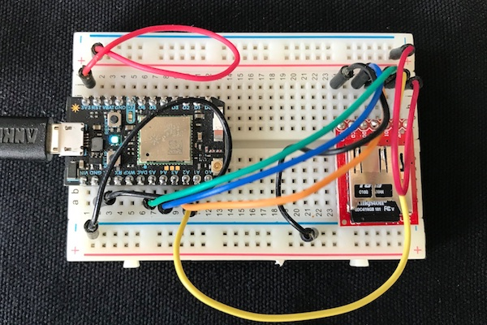
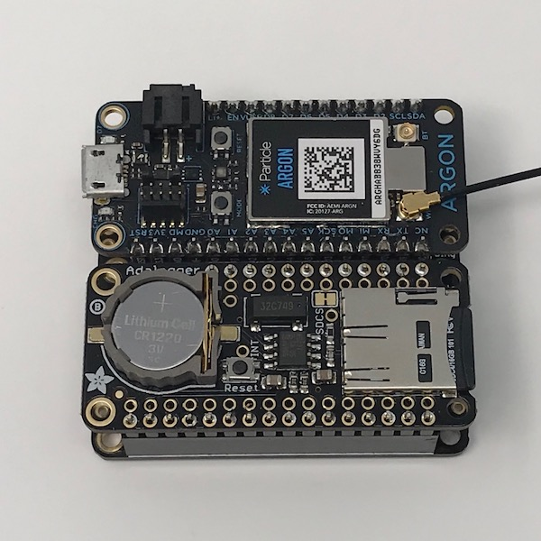

# SdCardLogHandlerRK

*Library for writing rotating logs to SD card on the Particle Photon and Electron*

The [full browsable API documentation is here](http://rickkas7.github.io/SdCardLogHandlerRK/).

The official location for this library is: [https://github.com/rickkas7/SdCardLogHandlerRK](https://github.com/rickkas7/SdCardLogHandlerRK).

It's in the Particle community libraries as: SdCardLogHandlerRK.

It's also possible (as of version 0.0.5) to use this to write an arbitrary stream of data, not hooked into the logging API. See SdCardPrintHandler, below.

## Hardware

You'll need a SD card reader, presumably a Micro SD card reader. Make sure you get one that's compatible with the 3.3V logic levels used on the Photon and Electron. Some readers designed for the Arduino expect the 5V logic levels used by the original Arduino. I use [this one from Sparkfun](https://www.sparkfun.com/products/13743) but there are others. [This one from Adafruit](https://www.adafruit.com/product/254) works as well.




The SD card reader connects via the SPI interface. There are two SPI interfaces on the Photon and Electron and you can use either. Note that each SPI device must have a separate SS (sometimes called CS) pin. While it's listed in the table below as A2 (or D5), you can use any GPIO pin.

Primary SPI (SPI object)

- A2 SS
- A3 SCK
- A4 MISO
- A5 MOSI

Secondary SPI (SPI1 object)

- D5 SS
- D4 SCK
- D3 MISO
- D2 MOSI

In the picture above:

| Device | SPI Name | SD Reader | Color  |
| ------ | -------- | --------- | ------ |
| A2     | SS       | /CS       | Yellow |
| A3     | SCK      | SCK       | Orange |
| A4     | MISO     | DO        | Blue   |
| A5     | MOSI     | DI        | Green  |
| 3V3    |          | VCC       | Red    |
| GND    |          | GND       | Black  |
|        |          | CD        |        |


### Adafruit AdaLogger FeatherWing

You can also use the [Adafruit AdaLogger FeatherWing](https://www.adafruit.com/product/2922). It contains an SD card reader and a RTC (real-time clock).



It connects to primary SPI (SPI object). The default connection is D5 for the SD card CS pin. It's possible to cut a trace and add a jumper wire to change the CS pin.

- D5 CS
- SCK
- MISO
- MOSI


## Using the library

This library uses the [Logging API](https://docs.particle.io/reference/firmware/#logging) that was added in system firmware 0.6.0.

For example:

```
Log.trace("Low level debugging message");
Log.info("This is info message");
Log.warn("This is warning message");
Log.error("This is error message");

Log.info("System version: %s", System.version().c_str());
```

It does not remap Serial, so if you're using Serial.print for logging, you should switch to using Log.info instead.

The library creates a directory (default: "logs") at the top level of the SD card and stores the log files in that. Each log file is a .txt file 6-digit number beginning with 000001.txt. 

The default log file is 1 MB (1000000 bytes), but you can reconfigure this. The actual size will be slightly larger than that, as the log is rotated when it exceeds the limit, and the file will always contain a whole log entry.

When rotated, the default is to keep 10 log files, but this is configurable. The oldest is deleted when the maximum number is reached.

By default, SdCardLogHandler writes to Serial as well, like SerialLogHandler. This can be reconfigured.

This is the example program:

```
#include "Particle.h"

#include "SdFat.h"
#include "SdCardLogHandlerRK.h"

SYSTEM_THREAD(ENABLED);

const int SD_CHIP_SELECT = A2;
SdFat sd;

SdCardLogHandler logHandler(sd, SD_CHIP_SELECT, SPI_FULL_SPEED);

size_t counter = 0;

void setup() {
	Serial.begin(9600);
}

void loop() {
	Log.info("testing counter=%d", counter++);
	delay(1000);
}
```

### Initialize the SdFat library

You normally initialize the SdFat library by creating a global object for it. For example:

```
SdFat sd;
```

If you are using SPI1 (the D pins) instead, use:

```
SdFat sd(1);
```

Note that you should not call `sd.begin()` in setup! The begin call is done by the SdCardLogHandler because it needs to be done earlier than setup, and also every time the card is ejected. 

If you need to check for a successful call to begin in your code, instead using `logHandler.getLastBeginResult()`. You might do this before using the SD card in your code. If there is no SD card inserted, the result will be false.

### Initialize the SdCardLogHandler

Normally you initialize the SdCardLogHandler by creating a global object like this:

```
SdCardLogHandler logHandler(sd, SD_CHIP_SELECT, SPI_FULL_SPEED);
```

- `sd` is the `SdFat` object, as described in the previous section
- `SD_CHIP_SELECT` is the pin connected to the CS/SS pin. In the code above, `SD_CHIP_SELECT` is set to A2.
- `SPI_FULL_SPEED` determines the speed to use, either full or `SPI_HALF_SPEED`.

There are also two optional parameters:

```
SdCardLogHandler logHandler(sd, SD_CHIP_SELECT, SPI_FULL_SPEED, LOG_LEVEL_TRACE);
```

The next optional parameter allows you to set the logging level.

- `LOG_LEVEL_ALL` : special value that can be used to enable logging of all messages
- `LOG_LEVEL_TRACE` : verbose output for debugging purposes
- `LOG_LEVEL_INFO` : regular information messages
- `LOG_LEVEL_WARN` : warnings and non-critical errors
- `LOG_LEVEL_ERROR` : error messages
- `LOG_LEVEL_NONE` : special value that can be used to disable logging of any messages

And finally, you can use logging categories as well to set the level for certain categories:

```
SdCardLogHandler logHandler(sd, SD_CHIP_SELECT, SPI_FULL_SPEED, LOG_LEVEL_INFO, {
	{ "app.network", LOG_LEVEL_TRACE } 
});
```

That example defaults to INFO but app.network events would be at TRACE level.

### Using SdCardPrintHandler

Instead of using SdCardLogHandler, you can use SdCardPrintHandler. This works like SdCardLogHandler, except it does not hook into the system log handler. This makes it useful for logging arbitrary data, and not have system logs mixed in.

```
SdCardPrintHandler printToCard(sd, SD_CHIP_SELECT, SPI_FULL_SPEED);
```

You can use any of the print, println, or printf methods to print to the log file. The same circular log file structure is used, and the card is only written to after a \n or println. A line is never broken up across multiple files.

```
printToCard.println("testing!");
```

### Options

The options below work with both SdCardLogHandler and SdCardPrintHandler.

There are also options available to control how logging is done. For example, if you want to change the default log file size to (approximately) 50000 bytes:

```
SdCardLogHandler logHandler(sd, SD_CHIP_SELECT, SPI_FULL_SPEED, LOG_LEVEL_TRACE);
STARTUP(logHandler.withDesiredFileSize(50000));
```

You can chain these together fluent-style to change multiple settings:

```
SdCardLogHandler logHandler(sd, SD_CHIP_SELECT, SPI_FULL_SPEED, LOG_LEVEL_TRACE);
STARTUP(logHandler.withDesiredFileSize(50000).withMaxFilesToKeep(5));
```

By default, SdCardLogHandler writes the log entries to Serial like SerialLogHandler. You can turn this off by using:

```
SdCardLogHandler logHandler(sd, SD_CHIP_SELECT, SPI_FULL_SPEED, LOG_LEVEL_TRACE);
STARTUP(logHandler.withNoSerialLogging());
```

Or if you want to log to Serial1 (or another port) instead:

```
SdCardLogHandler logHandler(sd, SD_CHIP_SELECT, SPI_FULL_SPEED, LOG_LEVEL_TRACE);
STARTUP(logHandler.withWriteToStream(&Serial1);
```

Normally, a sync operation is done after each log entry, which maximizes the chance the the log entry will be written out to SD card successfully. However, this will slow down operation if you do a lot of logging. You can have the SdFat library manage its own sync, which happens about every 512 bytes of log messages, by turning off sync after every entry:

```
SdCardLogHandler logHandler(sd, SD_CHIP_SELECT, SPI_FULL_SPEED, LOG_LEVEL_TRACE);
STARTUP(logHandler.withSyncEveryEntry(false);
```

Finally, when the SD card is ejected, a check for being inserted is only done at most every 10 seconds. This is because there's a timeout operation that makes the operation slow, and doing it on every log entry would make the performance very bad. You can change this interval by using:

```
SdCardLogHandler logHandler(sd, SD_CHIP_SELECT, SPI_FULL_SPEED, LOG_LEVEL_TRACE);
STARTUP(logHandler.withCardCheckPeriod(30000);
```

The value is in milliseconds; that changes the value from 10 seconds to 30 seconds.


## Version History

### 0.1.0

- Breaking change: logHandler.loop() must be called from loop()

- Breaking change: SdCardLogHandler must be called with a size parameter that specifies the size of the ring buffer. 

```
SdCardLogHandler<2048> logHandler(sd, SD_CHIP_SELECT, SPI_FULL_SPEED);
```

On Gen 3 devices, calling the SPI SD card from a log handler caused connection failures, and it never really was safe
before, either. Now, a ring buffer is used to transfer the data from the log handler loop. The API change allows the
buffer size to be specified, but also acts as a speed bump to warn users that the log handler setup() and loop() methods
must be called, otherwise no data will be logged.


### 0.0.6

- Breaking change: logHandler.setup() must be called from setup(). 

This fixes a problem where the log handler cannot be initialized from a global constructor in 0.8.0.rc, particularly with Gen 3 devices.
 


